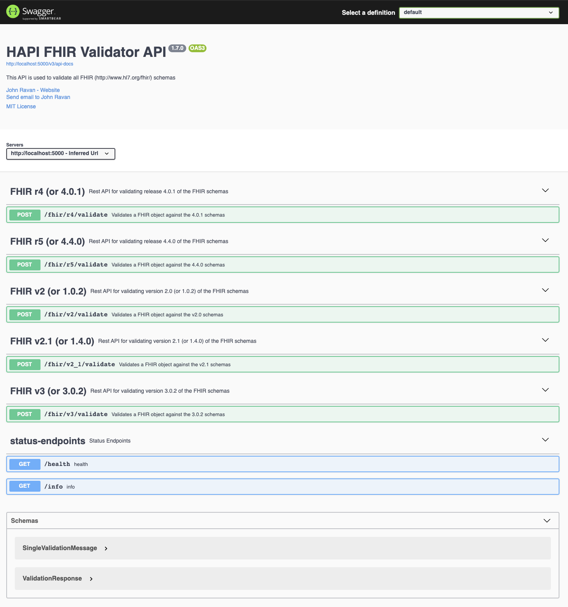
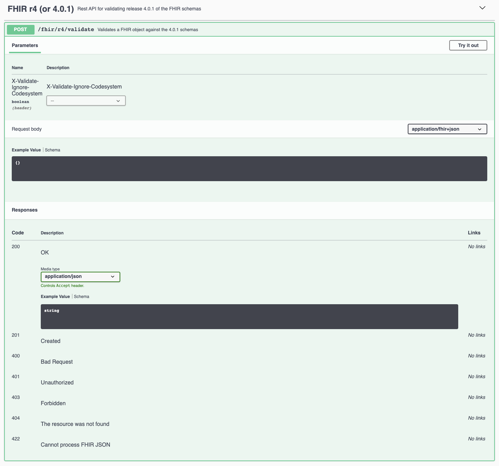

# HAPI FHIR Validator API


[](https://opensource.org/licenses/MIT)
[](http://makeapullrequest.com)

## What is the FHIR Validator API?

The HAPI FHIR Validator API is a simple REST API in order to validate the structure and content of a FHIR object. The API uses
the HAPI FHIR framework located at [https://hapifhir.io/](https://hapifhir.io/) in order to validate different all versions
of FHIR objects. [FHIR](https://www.hl7.org/fhir/overview.html) stands for Fast Healthcare Interoperability Resources which
is a standard for data transmission within healthcare.

## Structure of the API

See our [Swagger Hub API](https://app.swaggerhub.com/apis/jtravan/hapi-fhir-validator-api/1.5.0)

If you want to see the raw JSON visit [http://localhost:5000/v2/api-docs](http://localhost:5000/v2/api-docs)

## Get Started

Check out our [How To Validate FHIR Resources Guide](https://github.com/jtravan3/hapi-fhir-validator-api/blob/master/docs/how-to-validate-fhir-resources.md)

## Quickstart

```bash
docker run --name hapi-fhir-validator-api -p 5000:5000 jtravan3/hapi-fhir-validator-api:latest
```

Access the API by visiting [http://localhost:5000/swagger-ui/index.html](http://localhost:5000/swagger-ui/index.html). From there you can hit the endpoints directly.

## Developer Setup

### Environment Setup (Without Docker)

1.) Install maven 3.6.0 and Java JDK 11. JDK located [here](https://openjdk.java.net/install/) or use the Maven wrapper
that's a part of this repository.

```bash
brew install maven
```

2.) Clone down the repository from Github

```bash
git clone git@github.com:jtravan3/hapi-fhir-validator-api.git
```

3.) After populating the properties build the project

```bash
./mvnw clean install
```

4.) Run the api.

```bash
./mvnw spring-boot:run
```

The project is configured with Spring dev tools which allows for hot reloads without restarting the application. Simply
rebuild the project after making a change (In IntelliJ use `Build -> Build Project` or `CMD + F9`) and the application will
auto re-deploy.

5.) Access the API by visiting [http://localhost:5000/swagger-ui/index.html](http://localhost:5000/swagger-ui/index.html). From there you can hit the endpoints directly.

6.) Success!

## Docker Setup

1.) Install Docker located [here](https://docs.docker.com/docker-for-mac/install/).

2.) Clone down the repository from Github

```bash
git clone git@github.com:jtravan3/hapi-fhir-validator-api.git
```

3.) Run the API

```bash
docker-compose up
```

4.) Access the API by visiting [http://localhost:5000/swagger-ui/index.html](http://localhost:5000/swagger-ui/index.html). From there you can hit the endpoints directly.

5.) Success!

## Using Swagger

1.) Access the API at [http://localhost:5000/swagger-ui/index.html](http://localhost:5000/swagger-ui/index.html). You should see the following homepage.



2.) Once on the API, select the validation endpoint that you want to try out.



3.) Replace the `{}` with the FHIR JSON object that you want to validate


4.) Click *Execute* and then scroll down to see the response. If the response is successful you should see a JSON response of success

```json
{
  "successful": true,
  "errors": [],
  "warnings": [],
  "info": [],
  "exception": null
}
```

If there are issues the messages will be associated with their designated severity level.

```json
{
  "successful": false,
  "errors": [
    {
      "message": "Unrecognised property '@nae'",
      "locationString": "/Parameters/parameter",
      "severity": "ERROR",
      "locationLine": null,
      "locationCol": null
    },
    {
      "message": "Unrecognised property '@valeString'",
      "locationString": "/Parameters/parameter/part",
      "severity": "ERROR",
      "locationLine": null,
      "locationCol": null
    },
    {
      "message": "Profile http://hl7.org/fhir/StructureDefinition/Parameters, Element 'Parameters.parameter[1].name': minimum required = 1, but only found 0",
      "locationString": "Parameters.parameter[1]",
      "severity": "ERROR",
      "locationLine": null,
      "locationCol": null
    },
    {
      "message": "cvc-complex-type.2.4.a: Invalid content was found starting with element '{\"http://hl7.org/fhir\":valueBoolean}'. One of '{\"http://hl7.org/fhir\":extension, \"http://hl7.org/fhir\":modifierExtension, \"http://hl7.org/fhir\":name}' is expected.",
      "locationString": null,
      "severity": "ERROR",
      "locationLine": 1,
      "locationCol": 79
    }
  ],
  "warnings": [],
  "info": [],
  "exception": null
}
```

## Contributing
Please see [CONTRIBUTING.md](https://github.com/jtravan3/hapi-fhir-validator-api/blob/master/CONTRIBUTING.md) for more details regarding contributing issues or code.

## Questions
If you are experiencing a bug, please feel free to file an issue. For general questions, please post them to [StackOverflow](https://stackoverflow.com/search?q=hapi-fhir-validator-api) with the tag `hapi-fhir-validator-api`.

## License
The content of this project itself is licensed under the [Creative Commons Attribution 3.0 Unported](https://creativecommons.org/licenses/by/3.0/) license, and the underlying source code used to format and display that content is licensed under the [MIT license](https://github.com/jtravan3/hapi-fhir-validator-api/blob/master/LICENSE.md).

## Resources

### Spring Boot

For further references with Spring Boot:

- [Spring Initializr](https://start.spring.io/)
- [Getting Started](https://spring.io/guides/gs/spring-boot/)

### Maven

For further references with Maven's dependency management framework:

- [Spring and Maven](https://spring.io/guides/gs/spring-boot/)
- [Official Apache Maven documentation](https://maven.apache.org/guides/index.html)
- [Apache Maven Getting Started](https://maven.apache.org/guides/getting-started/)

